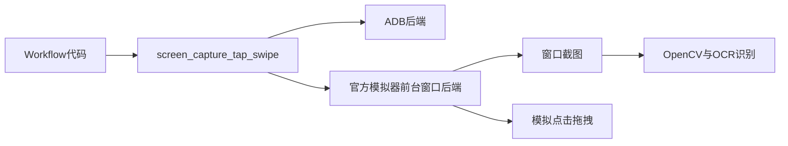

# 新版模拟器适配计划

## 改造范围
- 依赖管理：新增 [pyproject.toml](pyproject.toml) 并用 `uv` 管理运行依赖，移除 README 里的 `pip install -r requirements.txt` 说明。当前仓库没有 `requirements.txt`，依赖需要从导入整理：`PySide6`、`opencv-python`、`numpy`、`Pillow`、`PyYAML`、`easyocr`，以及官方模拟器前台控制所需的 `mss`、`pyautogui`、`pygetwindow` 或 `pywin32`。
- 设备控制：保留现有 `ADBClass.AdbSingleton.getInstance().screen_capture/tap/swipe/startApp` 调用边界，在 [ADBClass.py](ADBClass.py) 内拆成后端模式：`adb` 与 `window`。这样 [workflow/MainMaterial.py](workflow/MainMaterial.py)、[workflow/StartApp.py](workflow/StartApp.py)、[workflow/ReceiveReward.py](workflow/ReceiveReward.py)、[workflow/WeekTower.py](workflow/WeekTower.py) 不需要大面积重写。
- 官方模拟器模式：新增/内置窗口后端，按窗口标题定位官方模拟器，把窗口置前，截取客户端区域到 `./img/*.png`，并将 1280x720 的游戏坐标转换成屏幕坐标执行点击/拖拽。先做前台模式，接口预留 `backend=window`，以后再试后台消息点击。
- 简体中文：把 OCR 初始化从繁中模型切到简中优先，并让繁中作为兼容可选项；同步把 UI 文案、README、默认配置中的繁体任务名/角色名改成简体。重点位置是 [OCRClass.py](OCRClass.py) 的 `easyocr.Reader(['ch_tra', 'en'])` 和 [app_config.yaml](app_config.yaml) 的任务、角色配置。
- 新版素材：现有流程大量依赖 [Icons/](Icons/) 模板图和固定坐标，例如资源本入口、返回按钮、奖励图标、开始/代行按钮、战斗中图标等。新版 UI 变动后需要替换这些模板并复核坐标。

## 设计草图

## 需要你准备的素材/信息
- 官方模拟器安装好游戏，窗口标题或进程名；脚本运行时保持官方模拟器前台可被控制。
- 模拟器画面固定为 `1280x720`，并尽量关闭缩放、旋转、侧边栏遮挡；Windows 显示缩放最好先用 100% 或确认截图坐标没有偏移。
- 新版简体界面的关键截图/模板图，建议每张只截 UI 小区域：登录开始按钮、公告关闭、主页资源入口、返回按钮、每日/资源菜单标识、各资源本入口、难度/关卡编号区域、代行/开始按钮、免费代行确认、战斗加速/自动按钮、战斗结束/胜利/升级弹窗、奖励入口/领取按钮。
- 新版关卡与角色清单：资源本类别、最高难度、中间分页数量、角色简体名称。旧配置在 [app_config.yaml](app_config.yaml)，需要按新版更新。

## 实施步骤
1. 添加 uv 项目文件和启动说明：`uv sync`、`uv run python main.py`，并锁定 Python 版本为兼容 `match/case` 的 `>=3.10`。
2. 在 [ADBClass.py](ADBClass.py) 建立后端抽象，保留原方法名；新增 `window` 后端实现窗口查找、截图、点击、拖拽、分辨率校验。
3. 更新 [app_config.yaml](app_config.yaml) 和 UI 设置页：增加 `controlMode: window`、`windowTitle`、`baseResolution: [1280, 720]`，保留 ADB 字段作为兼容模式。
4. 切换简体中文支持：更新 [OCRClass.py](OCRClass.py) 语言配置，替换 UI/README/配置中的繁体默认文案；必要时增加繁简兼容匹配。
5. 替换并整理新版 [Icons/](Icons/) 素材引用，集中阈值和路径检查，避免模板缺失时静默失败。
6. 做一次最小验证：启动 UI、识别官方模拟器窗口、截图保存、点击一个无风险位置、跑“领取奖励”或“开始唤醒”的 dry-run/半自动验证。

## 风险与边界
- 官方模拟器如果屏蔽普通鼠标模拟，前台模式也可能需要改成更底层的 Win32/SendInput；本计划先保留接口，便于替换实现。
- 新版 UI 如果布局变化很大，只改素材可能不够，需要重标坐标和重写部分导航逻辑。
- OCR 简体识别会受字体、缩放和抗锯齿影响，角色选择这类流程建议优先用新版小图模板或更稳定的裁剪区域。